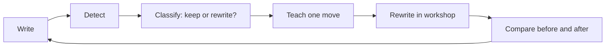

# UX Two: Change Suggestions From Code + Framework Review

Status: Design recommendations. Not implementation spec.

This document is a senior UX second pass. It builds on:

- [THINKING_NOTES.md](./THINKING_NOTES.md) — the mental model (Up / Down / Wide, Frame, Bridge, audience levels)
- [UX-ONE.md](./UX-ONE.md) — the first experience plan
- Current app code — editor, chips, tree, drawer, fix overlay, rewrite compare overlay, settings, Tauri shell

UX-ONE describes where the product should go. UX-TWO focuses on **what to change next**, grounded in what exists today and what the framework actually asks the user to learn.

---

## Executive Summary

Structure Coach already gives fast feedback. The recent rewrite overlay work moves in the right direction: editable draft, hide/resume, issue summary on the source text, status messaging, and user-owned output.

The remaining UX gap is not “more highlights.” It is **turning detection into a repeatable move**:

> When I see X, I know whether to move Up, Down, or Wide — and I know one rewrite action to try.

Every change suggestion below should be judged against that sentence.

---

## What Changed Since UX-ONE (Code Reality)

These are now partially implemented and should be treated as foundations, not finished UX:

| Surface | Current behavior | UX gap |
|--------|-------------------|--------|
| Rewrite overlay | Side-by-side original + editable draft; Hide / Discard; floating “Open Rewrite Draft” | Still named and framed as “AI Rewrite,” not a workshop |
| Original column | Highlighted source + issue chips | Chips open Fix overlay but do not teach Frame vs nesting |
| Draft lifecycle | Session survives Hide; Discard clears; dirty edits preserved during LLM | No “Apply to editor,” no diff, no explicit AI vs My draft lanes |
| Main toolbar | “✨ AI Rewrite” is primary AI entry | Implies automation over learning |
| Core question | “Does the other person have enough context?” | Static; does not connect to Up / Down / Wide |
| Issue chips | Short labels: Weak, Prep, Nom, Fill, etc. | Read as errors, not “check this” |
| Tree (60% width) | SVG sentence map with glyphs | High visual cost, low teaching return for framework goals |
| Fix overlay | Auto-fetches AI per flagged sentence | Surprising token use; read-only rewrites; no manual path |
| Drawer | Static examples + Smart Fix | Mixed Learn / Fix / long-guide links |
| Settings | Provider + key + model | No connection test; AI failure feels like writing failure |
| Persistence | Session-only text | Draft loss on restart breaks “thinking workspace” trust |

UX-TWO assumes these foundations stay. The suggestions refine them rather than replace the architecture.

---

## Design North Star (From THINKING_NOTES)

The app should help the user answer three questions in order:

1. **Where am I in the thought?** → Frame, Point, Action, Bridge
2. **Which direction does the reader need next?** → Up, Down, or Wide
3. **What is one move I can try?** → Keep, split, name actor, add why, add bridge, check pattern

Grammar terms (preposition, passive, nominalization) are **evidence**, not the product language.

---

## Guiding UX Principles (Second Pass)

### 1. Check, not condemn

Highlights mean: *inspect this*, not *delete this*.

**Change:** Shift chip and highlight copy from rule names to thinking moves. Use neutral color language for “suspicious” and reserve strong red only for “heavy” nesting or repeated failure after user review.

### 2. One move at a time

The user is building a mental anchor. Overlays that show eight issue types at once teach counting, not structure.

**Change:** Default to the **top one or two moves** worth attention. Let the user expand to “Show all checks.”

### 3. User owns the final text

AI is a suggestion engine inside a manual workspace.

**Change:** Always show two lanes in rewrite flow: **My draft** (primary) and **AI suggestion** (secondary, optional, collapsible).

### 4. Truth before polish

Coaching should not smooth away hard facts.

**Change:** AI prompts and UI copy should ask: *What is true? Who is affected? Why does it matter?* before *Make this cleaner.*

### 5. Match audience level

LLM command writing, operator process writing, and business-level writing need different questions.

**Change:** Add a lightweight **Audience** control (even a 3-option segmented control) that changes coaching questions, not just labels.

---

## Priority Change Suggestions

### Priority A — Reframe the rewrite experience (highest impact)

The rewrite overlay is the most advanced surface. Finish the workshop model UX-ONE started.

#### A1. Rename the feature

| Current | Suggested |
|--------|-----------|
| AI Rewrite — Compare | **Rewrite Workshop** |
| ✨ AI Rewrite (toolbar) | **Open Rewrite Workshop** or **Rewrite…** |
| Copy Rewrite | **Copy my draft** |
| Hide | **Hide workshop** |
| Discard | **Discard workshop** |
| Open Rewrite Draft | **Resume rewrite** |

Why: Names should reflect that the user is editing, not receiving output.

#### A2. Split “My draft” and “AI suggestion”

Current: one textarea that AI may overwrite unless the user edits first.

Suggested layout:

```
┌─────────────────────────────────────────────────────────────┐
│ Rewrite Workshop                              [Hide] [Discard]│
├──────────────────────────┬──────────────────────────────────┤
│ Your source text         │ My draft (editable, primary)      │
│ [issue chips]            │ [textarea — always user-owned]    │
│ [highlighted original]   │                                   │
│                          │ AI suggestion (optional)          │
│                          │ [collapsed by default]            │
│                          │ [Generate] [Insert into draft ▾]  │
└──────────────────────────┴──────────────────────────────────┘
```

Interactions:

- **Generate** runs LLM on snapshotted source (already partially implemented via `compareSourceText`).
- **Insert into draft** actions: replace all, append, merge paragraph — never silent overwrite.
- If user has edited draft, confirm before insert.

#### A3. Add movement controls to the workshop

Connect THINKING_NOTES directly to the rewrite pane:

Three compact buttons above the draft:

- **Move Up** — add or strengthen *why / impact*
- **Move Down** — add or strengthen *action / location / constraint*
- **Move Wide** — add or strengthen *pattern / related cases*

Each button opens a one-line prompt scaffold, not an auto-rewrite:

- Up: “This matters because ___”
- Down: “Do this: ___ in ___”
- Wide: “Check whether ___ also applies to ___”

User fills scaffold manually or optionally asks AI to draft into the suggestion lane.

#### A4. Status strip copy

Replace generic status with actionable states:

| State | Message |
|-------|---------|
| Generating | “AI is drafting a suggestion. Keep editing your draft — it won’t be overwritten.” |
| Done | “Suggestion ready. Review before inserting.” |
| Dirty + done | “Your draft was kept. AI suggestion is available if you want it.” |
| Error | “AI unavailable. Your draft is still here.” + **Open Settings** / **Try again** |

#### A5. Apply to main editor (later, with guardrails)

When added:

- Show diff modal: source editor vs workshop draft
- Default action: **Copy to clipboard**, not replace
- Secondary: **Replace editor text** with undo toast (“Undo apply”)

---

### Priority B — Turn chips into coaching, not counts

Issue chips are the main entry to learning. They currently behave like error badges.

#### B1. Rename chip labels (toolbar + workshop)

| Current chip | Suggested short | Suggested hover / panel title |
|-------------|-----------------|------------------------------|
| Weak | Hidden action | “Who is doing what?” |
| Prep | Frames | “Is this frame helping or hiding action?” |
| Nom | Noun not verb | “Can this noun become a verb?” |
| Fill | Wind-up | “Can you start at the point?” |
| Needless | Extra words | “What can you omit without losing truth?” |
| Spine | Subject–verb gap | “Are subject and verb too far apart?” |
| Stack | Noun pile | “Can you break up this noun chain?” |
| Flow | Missing bridge | “Does this sentence carry the last idea forward?” |

Keep internal rule keys (`sc-hl-prep`, etc.) unchanged in code; change user-facing strings only.

#### B2. Chip click = teach first, fix second

Current: chip → Fix overlay (sentence list + auto AI).

Suggested two-step panel (drawer or bottom sheet):

1. **What we noticed** — plain language, 1–2 sentences
2. **When to keep it** — bullet
3. **When to rewrite** — bullet
4. **Try this move** — one concrete strategy
5. Actions: **Highlight in text** · **Fix sentences** · **Ignore this check**

This matches THINKING_NOTES: *Frame → Actor → Action → Condition → Example*.

#### B3. Severity, not just count

Show chip as `Frames · 3` with subtle weight:

- **Check** (1–2 mild flags)
- **Heavy** (deep nesting, long frame chain)
- **Repeat** (same pattern in multiple sentences)

Color intensity should reflect severity, not mere presence.

#### B4. False-positive affordance

On any highlighted span, offer a lightweight context menu or chip action:

- **Keep — useful here**
- **Rewrite later**
- **Ignore this pattern in this doc**

Even without backend learning, this teaches judgment and reduces highlight fatigue.

---

### Priority C — Replace the static core question with movement intent

Current: `Does the other person have enough context?` — good but frozen.

Suggested replacement area (above editor):

```
What should your next sentence do?
[ Move Up ]  [ Move Down ]  [ Move Wide ]     Audience: [ Builder ▾ ]
```

Behavior:

- Selection is optional and session-scoped
- Changes the **coaching prompt** under the chips, not the analysis engine on day one
- Example when **Move Up** selected: “Consider adding why this matters.”
- Example when **Move Down** selected: “Consider naming location, action, and constraint.”
- Example when **Move Wide** selected: “Consider where else this pattern appears.”

This is the smallest UI step that connects THINKING_NOTES to daily use without waiting for new NLP rules.

---

### Priority D — Rework the right panel into a Structure Map

The tree uses ~60% of horizontal space. For the framework goals, a **sentence list with roles and bridges** will teach more.

Suggested Structure Map row:

```
S1  [Frame]   In the Welcome view, …          ⚠ Frames
S2  [Action]  Find the Better Tips section.   ✓ Clear action
S3  [Action]  Sort the list alphabetically.    ✓ Bridge: list → sort
S4  [?]       …                               ⚠ Missing bridge
```

Interactions:

- Click sentence → scroll editor + open coach drawer for that sentence
- Show bridge chain between rows: `section → that section → list`
- Optional: Up / Down / Wide hint per gap (“Add why between S3 and S4”)

Phase 1 can keep the tree behind a “Classic tree view” toggle to reduce risk.

---

### Priority E — Fix overlay: manual-first, AI-on-demand

Current fix flow auto-calls LLM for every flagged sentence. That is costly, surprising, and read-only.

Suggested changes:

1. **Explain before generate** — show matched phrase highlighted in each row
2. **Generate** per row or **Generate all** with explicit confirmation + count
3. **Editable rewrite cell** — same textarea pattern as workshop
4. **Why flagged** — one line from rule metadata (“Frame chain before main verb”)
5. **Copy row** default; no silent apply to main editor

Error copy should mirror workshop: preserve manual cell, link to Settings.

---

### Priority F — Drawer: separate Learn and Fix

Current drawer mixes reference examples, Smart Fix, and links to long guides.

Suggested tabs:

| Tab | Purpose |
|-----|---------|
| **Learn** | Contextual explanation for selected sentence / chip |
| **Fix** | Smart Fix with editable result |
| **Guides** | Links to full reader overlays |

When nothing selected, Learn shows framework primer:

> Communication moves Up, Down, or Wide. Start by naming what your reader needs next.

Smart Fix result should be copyable and editable, not a dead `<div>`.

---

### Priority G — Onboarding and AI optionalism

The setup banner currently appears when no key is set and frames AI as required for value.

Suggested flow:

1. **First launch:** user can write immediately; local rules work without AI
2. Banner copy: “Local checks are active. Add AI when you want rewrite suggestions.”
3. Primary CTA: **Continue without AI**
4. When user hits Generate / Smart Fix without provider: inline card with **Open Settings** and **Keep writing manually**

Settings additions (UX, not backend):

- **Test connection** button
- Status line: “Gemini · connected” / “Manual mode · no AI”
- Per-feature note: “Workshop and Smart Fix need a provider. Highlights do not.”

---

### Priority H — Desktop shell clarity

Two different “hide” concepts exist today:

| Action | Suggested label | Scope |
|--------|-----------------|-------|
| Hide app | **Hide to tray** | Whole window |
| Hide workshop | **Hide workshop** | Rewrite session only |

Add subtle **draft indicator** in title bar or toolbar when a workshop session exists:

> `Structure Coach · Rewrite in progress`

On restart, if draft persistence is added later, show recovery toast:

> “Restore your last workshop draft?”

---

### Priority I — Positive feedback (missing today)

The app is problem-heavy. Add a small “What’s working” strip when checks pass:

- ✓ Clear action verb found
- ✓ Specific target named
- ✓ Bridge connects to previous sentence
- ✓ Constraint stated

For LLM-command-style text, show:

> “Command structure: Location → Target → Action. Optional: add why for human readers.”

Positive feedback builds the same mental model as issue chips, in reverse.

---

## Surface-by-Surface Quick Wins (Low effort, high clarity)

These can ship independently of larger refactors:

| Surface | Quick win |
|---------|-----------|
| Toolbar | Rename AI button; add word + sentence count |
| Chips | Update labels + `aria-label` to thinking-move descriptions |
| Workshop | Title + button copy per A1; improve status messages per A4 |
| Workshop chips | Tooltip: “Click to learn about this check” |
| Escape key | Already hides workshop; add toast: “Workshop hidden — Resume rewrite” |
| Fix overlay | Stop auto-generate; add Generate button first |
| Drawer | Show selected sentence in full, not truncated one line |
| Reader guides | Split into cards; align headings with Frame / Bridge / Up-Down-Wide |
| Settings | “Manual mode works without a key” under provider select |

---

## Recommended Terminology (User-Facing)

Use in UI copy, drawer, and workshop:

| Use | Avoid as primary label |
|-----|------------------------|
| Frame | Preposition |
| Hidden action | Passive voice |
| Noun not verb | Nominalization |
| Missing bridge | Flow issue |
| Move Up / Down / Wide | (no equivalent — teach these) |
| Check | Error |
| My draft | AI rewrite |
| Workshop | Compare overlay |

Technical terms remain acceptable in advanced guides and developer docs.

---

## Learning Loop (Target Experience)

UX-TWO recommends designing every feature as one step in this loop:



Today the app strong at **Write → Detect**. The next UX sprint should complete **Classify → Teach → Compare**.

---

## Example: End-State Flow (Better Tips scenario)

**User writes (Builder audience):**

> In this URL, find the Better Tips section. Sort the list alphabetically.

**App shows:**

- Chips: `Frames · 1` `Clear actions · 2` `Missing why · optional`
- Structure map:
  - S1 Frame — URL scope
  - S2 Action — Find section
  - S3 Action — Sort list
  - Bridge OK: section → list
- Prompt: “Command is clear. Move Up to add why, or keep as LLM task.”

**User clicks Move Up in workshop scaffold, adds:**

> Users need to scan the list quickly.

**App shows:**

- ✓ Why added
- Suggested Wide: “Check other lists on the Welcome page”

This is the experience THINKING_NOTES describes. The code already has the surfaces; the copy, hierarchy, and interaction order need to catch up.

---

## Suggested Implementation Slices

Ship UX in thin vertical slices. Recommended order:

### Slice 1 — Language pass (1–2 days)

- Rename workshop, buttons, chips (A1, B1)
- Update status strings (A4)
- Add chip `aria-label`s and tooltips

No engine changes.

### Slice 2 — Teach-before-fix (3–5 days)

- Chip click opens coach panel with keep/rewrite/move copy (B2)
- Fix overlay: manual cells + Generate on demand (E)

### Slice 3 — Movement intent bar (2–3 days)

- Replace static core question with Up / Down / Wide selector (C)
- Coaching hint line reacts to selection

### Slice 4 — Workshop lanes (5–8 days)

- Separate My draft vs AI suggestion (A2)
- Insert-into-draft actions with confirm (A2, A5)

### Slice 5 — Structure map (larger)

- Sentence list with roles + bridge chain (D)
- Tree becomes secondary view

---

## Not Recommended (Reconfirmed)

- Do not add a grammar-score or “writing quality percentage”
- Do not auto-replace main editor text from AI
- Do not imply every `in` is wrong
- Do not expand long guides as the primary teaching path
- Do not add more issue types before teach/classify flow exists
- Do not optimize for polite prose over accurate prose

---

## Open Questions For Product + Design

1. Should **Audience** be explicit (user picks) or inferred from sentence patterns?
2. Should **Move Up / Down / Wide** affect AI prompts immediately, or only UI coaching at first?
3. Should false-positive “Keep” judgments persist per document, globally, or not at all in v1?
4. Is the tree worth keeping permanently, or only as a legacy view?
5. Should workshop drafts sync to main editor on a schedule, or only on explicit Apply?

---

## Success Metrics (Qualitative)

The UX changes succeed when the user can say:

- “I know why this was flagged.”
- “I know whether to keep it or rewrite it.”
- “I know whether my next sentence should go up, down, or wide.”
- “The AI helped, but I wrote the final version.”

If the user still says “the app says Prep: 3 and I don’t know what to do,” the UX work is not done.

---

## Document Relationship

| Doc | Role |
|-----|------|
| THINKING_NOTES.md | Why — mental model and vocabulary |
| UX-ONE.md | What — broad experience plan |
| UX-TWO.md | Next — concrete change suggestions tied to current code |

When implementation starts, track shipped items by slice above and strike through completed sections in future revisions of this file.
